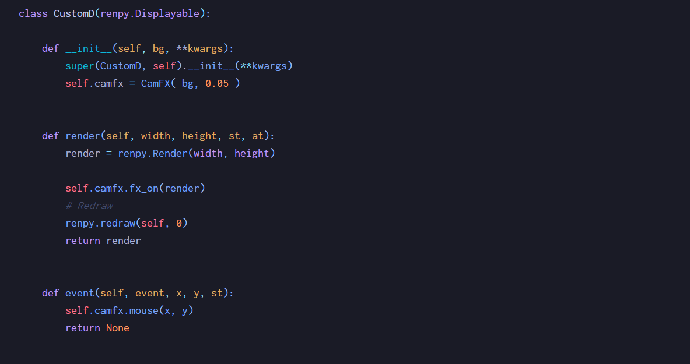
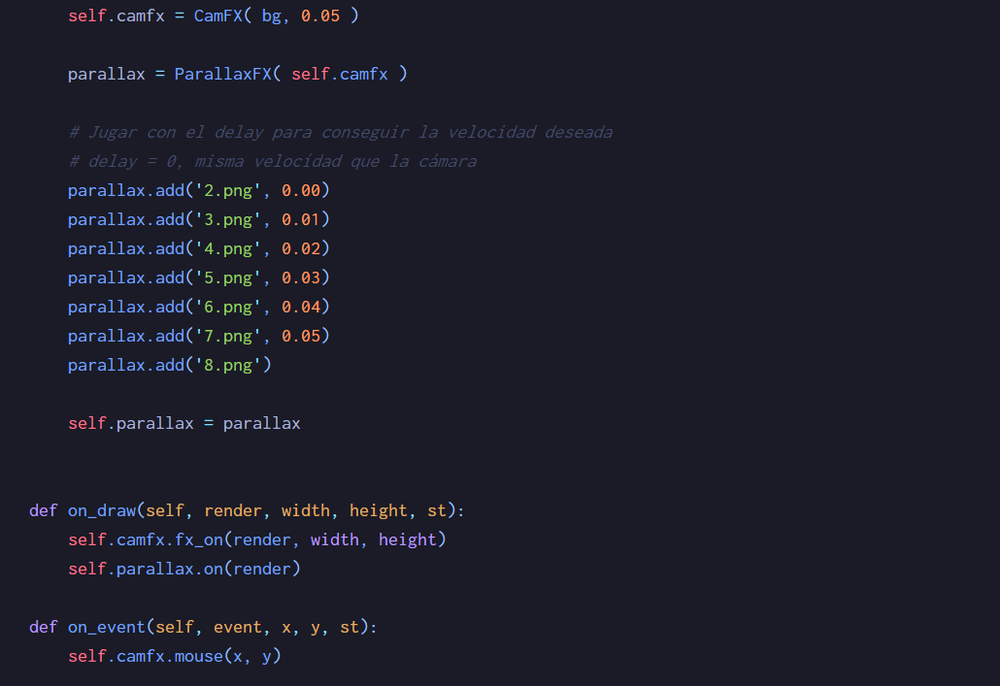
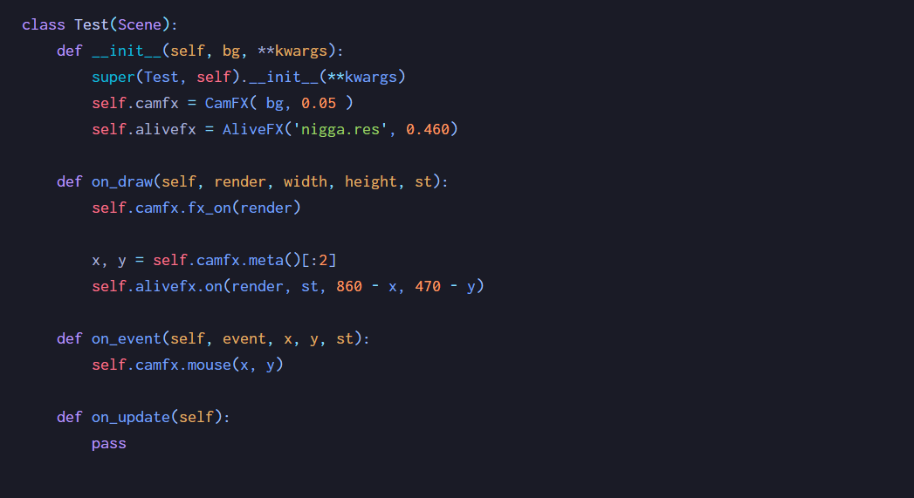

# Ren'Py Utils

Utilidades interesantes

> Creado el 25-05-2021


---



## Efecto cámara

Un efecto cámara para acabar con las aburridas pantallas estáticas en nuestras novelas visuales.

```python
default preferences.fullscreen = True

screen magic_camera:
    add CamFX('room.png', 1280, 720)

label start:
    call screen magic_camera with dissolve
```

> Las dimensiones del displayable se pueden personalizar con size() dentro del screen

<p align="center">

</p>


---



## Efecto parallax

Haciendo uso del efecto cámara se puede conseguir el efecto parallax de forma super simplificada para los eyes x e y, además de una velocidad de desplazamiento personalizada.

```python
default preferences.fullscreen = True

screen magic_camera:
    add Bosque('1.png')

label start:
    call screen magic_camera with dissolve
```

> La implementación es distinta a CamFX, se debe al uso de un gestor de escenarios para distribuir mejor la lógica dentro del juego (recomiendo su estructura, puede omitirse). Los ficheros nuevos son: `engine.rpy`, `scenes.rpy`, `camFX.rpy`, `parallaxFX.rpy`.


<p align="center">

</p>


---




## Animaciones

Haciendo uso de la herramienta `frame-tool.py`, puede ser usado desde la consola de comandos, acepta dos parámetros (último opcional): el nombre del fichero (`gif`, `webp`, `png`) y la extensión de los frames (`gif`, `webp`, `png`, `jpeg`) y lo comprime dentro de un fichero con extensión `.res`.

`AliveFX` recibe como parámetros:

- El recurso `*.res` previamente creado con la herramienta `frame-tool.py`
- Velocidad de reproducción en milisegundos `delay = 0.001 -> 1.0`
- Número de repeticiones de la animación `loop = 0`
- Reproducción en zig-zag `rever = False`
- Se plantea la posibilidad de añadir tras un ciclo un tiempo de pausa en milisegundos `sleep = 0.000`

Implementación:

```
default preferences.fullscreen = True

screen magic_camera:
    add Test('fondo.jpg')

label start:
    call screen magic_camera with dissolve
```

> Si se quiere posicionar la animación en un punto específico debe usarse CamFX. Extraer sus coordenadas en x e y mediante el método `meta()` y restarle a la posición de la animación en pantalla (esquina superior izquierda) con las coordenadas.

> De no usar CamFX, puede usarse de igual forma AliveFX con su propio displayable y posicionarlo con x e y.

> De forma experimental, puede usarse una animación como una imagen de fondo y dotarlo de todas las funcionalidades que aportan estas librerías. Ver ejemplo de uso en `scenes.py -> Test2()`
